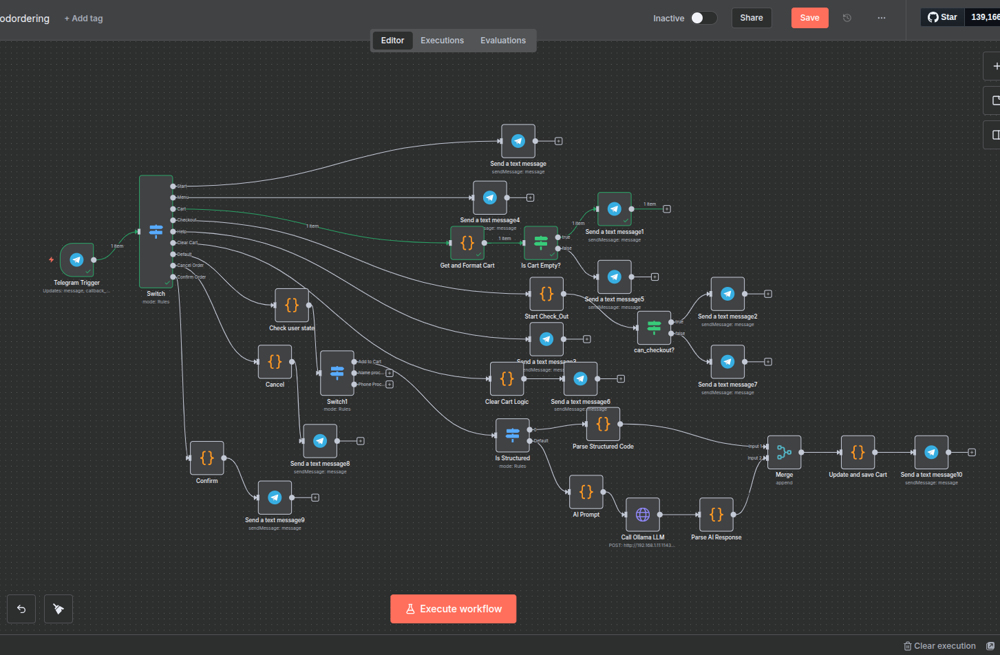

# n8n Mini Food-Ordering Chatbot

This project is a minimal yet reliable food-ordering chatbot built with n8n. It uses Telegram for the user interface and a locally hosted open-source LLM (Ollama with Llama 3.1) for natural language understanding.

## Features

- **Interactive Menu**: Users can view the menu, add items to a persistent cart, and view their cart.
- **Dual Input Methods**: Supports both structured commands (e.g., `BG1 x2`) and free-text orders (e.g., "I want a burger and two colas").
- **Stateful Cart**: The user's cart persists between messages.
- **Simple Checkout**: A streamlined checkout process that confirms the order and provides an Order ID.
- **Open-Source AI**: All AI processing is done locally using Ollama. No paid APIs are required.

## Workflow Diagram



## Tech Stack

- **Orchestration**: n8n
- **Chat Platform**: Telegram
- **Local LLM Server**: Ollama
- **LLM Model**: Llama 3.1 8B
- **Local Tunneling**: ngrok (for development)

## Setup and Installation

**Prerequisites:** Docker, Docker Compose, and [ngrok](https://ngrok.com/download) must be installed on your machine.

**1. Clone the Repository**
```bash
git clone https://your-repo-url.com/n8n-food-bot.git
cd n8n-food-bot
```

**2. Configure Environment Variables**
Create a `.env` file by copying the example file.
```bash
cp .env.example .env
```
Now, open the `.env` file and add your Telegram Bot Token.

**3. Run the Services**
Start the n8n and Ollama containers using Docker Compose. This will run them in the background.```bash
docker-compose up -d
```

**4. Expose Your Local n8n with ngrok**
Telegram needs a public HTTPS URL to send updates to your n8n instance. We will use ngrok to create a secure tunnel to your local machine.

- Open a **new terminal window**.
- Run the following command to expose your n8n instance (which is running on port `5678`):
```bash
ngrok http 5678
```
- ngrok will start and display a forwarding URL. Look for the line that starts with `Forwarding` and copy the `https://` URL. It will look something like this:
  `https://random-string-of-characters.ngrok-free.app`

**Keep this terminal window open!** If you close it, the public URL will stop working.

**5. Pull the LLM Model**
While ngrok is running, open another new terminal window. You need to pull the Llama 3.1 model into your Ollama instance.
```bash
docker exec -it ollama_food_bot ollama pull llama3.1:8b
```

**6. Set up n8n and the Telegram Webhook**
- Navigate to `http://localhost:5678` in your browser.
- Set up your n8n admin account.
- In the n8n main window, go to **Credentials** > **Add credential**.
- Search for "Telegram" and add your Telegram API token. Give it a memorable name.
- Go back to the main window, click **Import** > **From File**, and import the `workflow.json` from this repository.
- **Crucial Step:** Open the **Telegram Trigger** node in the imported workflow.
    - Make sure the `Credential to connect with` is set to the credential you just created.
    - You will see a `Webhook URL` displayed in a grey box. It will look like `https://<your-n8n-domain>/webhook/telegram/...`. We need to register this URL with Telegram.
- **Register the Webhook:**
    - Take the public `https://` URL from your ngrok terminal.
    - Append the webhook path from the n8n trigger node to it. The final URL will look like this:
      `https://random-string-of-characters.ngrok-free.app/webhook/telegram/1/webhook`
    - Open a chat with `@BotFather` on Telegram.
    - Send the command `/setwebhook`.
    - Select your bot.
    - Paste the complete ngrok webhook URL you just constructed and send it. BotFather should reply with "Webhook was set".

**7. Activate the Workflow**
Activate the workflow using the toggle in the top right corner of the n8n canvas.

## Usage

Open a chat with your bot in Telegram and send the `/start` command to begin. Your local n8n instance will now receive all messages sent to your bot.
